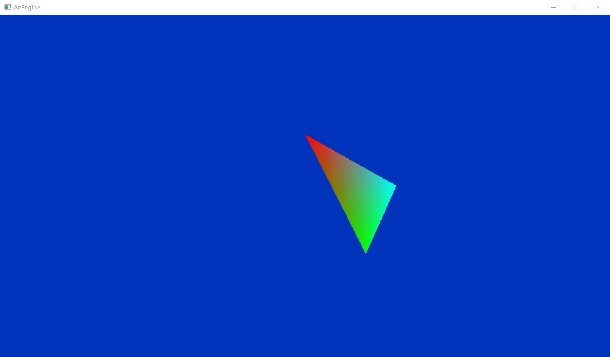

# AnEngine

&#8195;&#8195;AnEngine是一个使用DirectX 12开发的使用组件式设计模式的游戏引擎。之前的作用是完成图形学作业。
目前已经支持C++ 17标准，并添加了标准库模块支持（需要在VS2017的C++桌面开发项中添加标准库模块（实验性））。由于还是实验性，代码感知尚且不能，仅用于尝试。

## 特征
* 使用了组件式设计，所有的组件继承自BaseBehaviour类，由Scene统一调度。
* 对于游戏中可用的对象，都继承自ObjectBehaviour类，而ObjectBehaviour继承自BaseBehaviour和GameObject，既对于游戏对象将其抽象为一个GameObject，而对于其行为使用BaseBehaviour描述。其行为的具体内容由ObjectBehaviour中的虚函数覆写。
* 如果想要让场景中出现一张2D图片，那么需要对该对象用一个继承自ObjectBehaviour的类描述，假设其名称为Sprite，而图片需要由渲染器渲染，则需要实例化一个SpriteRenderer，该类继承自Renderer，而Renderer继承自ObjectBehaviour并重写了一些虚函数。需要调用Sprite::AddComponent(SpriteRenderer)，此时Sprite::gameObject == SpriteRenderer::gameobject，其中gameObject是指向对象的指针，对于Sprite来说，其gameObject == this。

## 正在开发的功能
* 计算引擎的调度
* 加载3D模型

### 已完成Demo（计算机图形学作业专用）
* 绘制三角形
* 绘制多边形
* 绘制任意斜率直线
* 使用Wu-反走样算法绘制任意斜率直线
* NBody
* 绘制顶点为随机颜色的立方体

## 开始
在Window项目中新建头文件和源文件（Test.h，Test.cpp），头文件中引用 Driver.h。
* Test.h
``` cpp
#pragma once
#include "Driver.h"

void LoadScene();

class TestCamera :public AnEngine::Game::ObjectBehaviour
{
public:
	TestCamera(std::wstring&& name);
};

```
&#8195;&#8195;为了保证最基本的图形渲染，我们需要一个场景，并在场景中添加一个三角形网格渲染器和一个照相机。因此在Test.h中声明了一个函数LoadScene()和一个类TestCamera。TestCamera继承自ObjectBehaviour，表示这是场景中一个活动的对象。由于ObjectBehaviour继承自GameObject和BaseBehaviour，而GameObject的构造函数显式声明为需要一个name作为参数，因此TestCamera也需要显式声明一个wstring作为参数的构造函数。注意，GameObject的name变量支持const wstring&和右值引用wstring&&，此处使用右值。
* Test.cpp
``` cpp
#include "Test.h"
using namespace AnEngine;
using namespace AnEngine::Game;
using namespace AnEngine::RenderCore;

Scene* testScene;
Camera* testCamera;

void LoadScene()
{
	testScene = new Scene(L"Test Scene");
	testCamera = new Camera(L"Test Camera");
	testCamera->ClearFlag(Camera::ClearFlags::SolidColor);
	testCamera->ClearColor(Color::Blue);

	TestCamera* camera = new TestCamera(L"Test Camera Object");
	camera->AddComponent(testCamera);

	TrangleRender* trangleRender = new TrangleRender(L"Test Render");
	camera->AddComponent(trangleRender);

	testScene->AddObject(camera);
	Driver::GetInstance()->BeginBehaviour(testScene);
}

TestCamera::TestCamera(std::wstring name) : ObjectBehaviour(name)
{
}
```
&#8195;&#8195;在CPP文件中对TestCamera的构造函数进行定义，这个对象并没有什么用，所以不需要在构造函数中做任何事情，只需要调用基类构造函数即可。<br/>
&#8195;&#8195;在LoadScene()中，我们创建了一个空场景testScene，一个照相机testCamera，将清空标志设置为纯色，填充颜色为蓝色（注：这里为了Debug在Camera代码中没有使用ClearColor变量作为填充，下一版本会修改）。然后实例化一个TestCamera对象camera，将照相机作为该对象的组件，即调用camera的AddComponent方法将testCamera挂上去。然后创建一个三角形网格渲染器，也作为组件挂到camera上。最后，将camera对象加入到场景中，使用Driver的BeginBehaviour()方法加载场景。

* WinMain.cpp：
```cpp
......
ShowWindow(window, nCmdShow);

LoadScene();

MSG msg = {};
while (msg.message != WM_QUIT)
{
	if (PeekMessage(&msg, NULL, 0, 0, PM_REMOVE))
	{
		TranslateMessage(&msg);
		DispatchMessage(&msg);
	}
}
......
```
在WinMain.cpp的合适位置调用LoadSence()，可看到运行效果如图：
